<a href="https://github.com/ayushkapure26/Ayush_prmm">Explore CNG Mitra</a> · <a href="https://github.com/ayushkapure26/Ayush_prmm/actions">Builds and APK</a> · <a href="https://www.linkedin.com/in/ayush-kapure-19152a281/">LinkedIn</a> · <a href="mailto:ayushkapure26@gmail.com">Email</a>

## Featured project
**CNG Mitra** helps drivers record refills, mileage and fuel spending. Built using Kotlin, Jetpack Compose, Room and coroutines, with offline Guest Mode and CSV import/export.

[Source code](https://github.com/ayushkapure26/Ayush_prmm) · [Development activity](https://github.com/ayushkapure26/Ayush_prmm/commits/main/)

Development project: station information is sample or community-reported. Online services require configuration.

## Certifications and job simulations
- Deloitte — Data Analytics Job Simulation, Forage, 19 September 2026.
- Freshfields — US Capital Markets Job Simulation, Forage, 17 September 2026.
- Tata — GenAI Powered Data Analytics Job Simulation, Forage, 16 September 2026.
- Accenture — Developer and Technology Job Simulation, Forage, 24 November 2024.

## Preview notes
Original artwork and layout inspired by the supplied reference. The animated initials are a placeholder for personal character art; no personal waving video was supplied. The contribution city awaits verified GitHub contribution data. Focus bars are decorative and do not represent proficiency or statistics.
